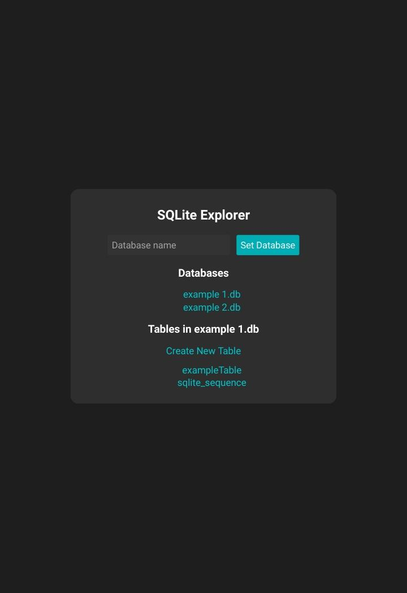

# SQLite Database Explorer  
# LWS25 🗄️🔍  

### 🎯 About  
SQLite Database Explorer is part of the **Local Web Software 2025 (LWS25)** project, designed to manage SQLite databases through a user-friendly web interface. This tool allows users to create databases, tables, and manage data without writing SQL queries.  

---



---

## ⚡ Features  
✅ Create and manage SQLite databases without SQL commands  
✅ Add, edit, and delete tables and records via UI  
✅ Import and export database files  
✅ Simple and intuitive web-based interface  

---

# 🚀 Installation  
## 1. Installing Packages  
- ### On Termux  
```bash  
pkg install python3 git sqlite
```
- ### On Linux

```bash 
apt install python3 git sqlite
```

---

2. Clone the Repository

git clone https://github.com/ezaco-dev/SQLite-Database-Explorer.git


---

3. Install Pip Packages

pip install -r requirements.txt


---

4. Run the Server

python3 app.py
